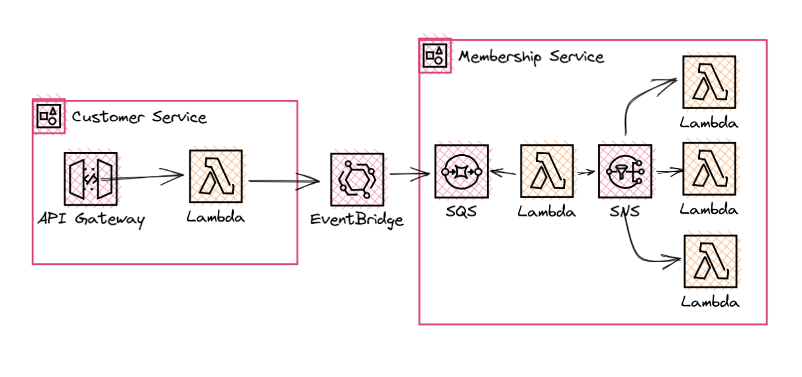
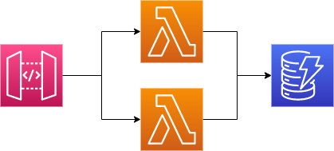

# Application Integration Patterns

Implementations of application integration patterns using AWS technologies. Deployed with Terraform.

## Video Walkthroughts

All the sample patterns in this repository have a corresponding walkthrough video on my YouTube channel. There's even a [playlist](https://www.youtube.com/watch?v=lttsFZV__Wo&list=PLCOG9xkUD90IDUehC4Ws9fLYyD4i0WBE4) to group them all together.

## Deploying Patterns

### Prerequisites

- [.NET 6](https://dotnet.microsoft.com/en-us/download/dotnet/6.0)
- [Terraform](https://developer.hashicorp.com/terraform/tutorials/aws-get-started/install-cli)
- An active AWS account

### Deploying

All patterns are built using Terraform. To deploy into your own AWS account navigate into the folder of your choice and run either the deploy.ps1 or deploy.sh scripts depending on your OS.

```powershell
cd src\patterns\anti-corruption-layer
deploy.ps1
```

```bash
cd src/patterns/anti-corruption-layer
deploy.sh
```

The deployment script will first compile the .NET applications and then run a terraform apply command to deploy the required resources.

## Patterns

### [Anti Corruption Layers](./src/patterns/anti-corruption-layer/)

[Video](https://youtu.be/5twczseztR0)

An implementation of the anti-corruption layer using Amazon EventBridge, Amazon SQS and Amazon SNS.



1. POST /customer request comes into API Gateway. Lambda function takes the request, creates the customer and publishes a CustomerCreatedEvent to Amazon EventBridge.

```json
{
  "EmailAddress": "test@test.com",
  "Name": "James"
}
```
2. The Membership service defines a rule on EventBridge to route CustomerCreated events to an SQS target
3. A Lambda function acting as an anti-corruption layer takes the event from the customer service, adapts that to be an event the membership service understands and publishes to an SNS topic owned by the membership team
4. Event is fanned out to various Lambda functions performing different jobs

### [Scatter Gather](./src/patterns/scatter-gather/)

An implementation of the scatter gather pattern using an aggregator to combine results.


1. Step Functions workflow is invoked with details of the loan that quotes are required for. This workflow publishes a request-loan-offers event to Event Bridge. The event payload includes a correlation id, as well as details of the loan.
``` json
{
  "CustomerId": "James Eastham",
  "CorrelationId": "2354235231",
  "LoanAmount": 567.98
}
```
2. A seperate Lambda function per bank/vendor is deployed that implements specific loan generation logic for that bank. The Lambdas are configured with Event Bridge as an event source, listening for the request-loan-offers event

3. As each vendor processor completes it in turn publishes an event to event bridge containing details of the quoted loan. This event also includes the correlation id from the original request. This vendor specific data is stored in a DynamoDB table with the correlation id as the partition key

4. After a pre-defined wait period, the Step Function workflow continues. A Lambda is invoked to aggregate the results from the DynamoDB table and return the final combined list of loan offers.

### [Pub/Sub](./src/patterns/pub-sub/)

[Video](https://youtu.be/lttsFZV__Wo)

An implementation of the publish/subscribe pattern, using both Amazon Event Bridge and AWS SNS as the message channel.


### [Synchronous API](./src/patterns/synchronous-api/)

[Video](https://youtu.be/lttsFZV__Wo)

Implementation of a simple REST API that allows the creation and retrieval of products.



## Pattern Roadmap

- [Request-Reply](https://www.enterpriseintegrationpatterns.com/RequestReply.html)
  - Return address
  - CorrelationId
- [Smart Proxy](https://www.enterpriseintegrationpatterns.com/SmartProxy.html)
- [Routing Slip](https://www.enterpriseintegrationpatterns.com/patterns/messaging/RoutingTable.html)
- [Resequencer](https://www.enterpriseintegrationpatterns.com/Resequencer.html)
- [Wire Tap](https://www.enterpriseintegrationpatterns.com/patterns/messaging/WireTap.html)
- [Message History](https://www.enterpriseintegrationpatterns.com/patterns/messaging/MessageHistory.html)
- [MessageStore](https://www.enterpriseintegrationpatterns.com/patterns/messaging/MessageStore.html)
